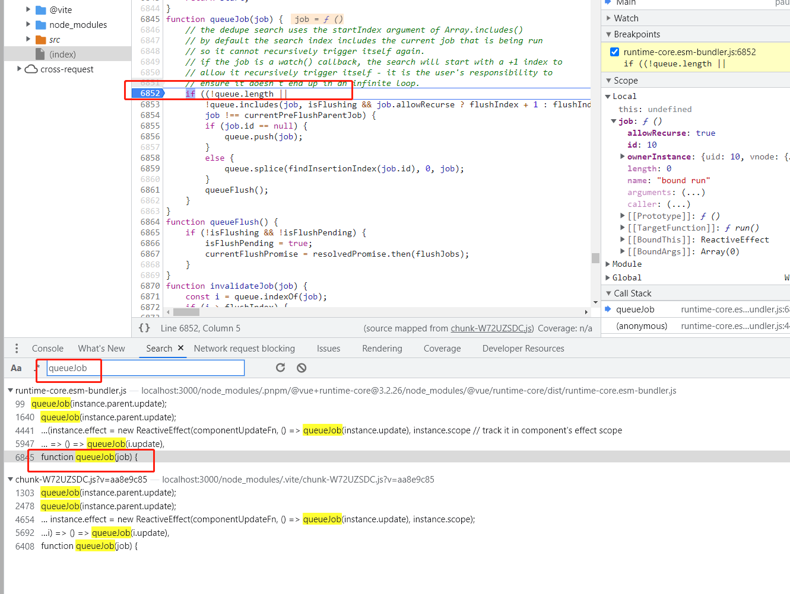

# Demo 1 —— 延迟 DOM 更新及队列 Job 去重
该 Demo 用于说明 vue 为什么需要队列，以及队列拥有 Job 去重的特性
```html
<template>
  <div>{{count}}</div>
  <button @click='add'>Add</button>
</template>
<script setup lang='ts'>
import { ref } from 'vue'

const count = ref(0)

function add() {
  count.value = count.value + 1
  count.value = count.value + 2
}
</script>
```
## 延迟 DOM 更新
当点击按钮，count.value 被修改时，没有立即执行 DOM 操作修改界面（对比 vnode 差异，然后执行 DOM 操作这个过程，术语叫 **patch**）。等所有组件数据都更新完成了，再统一地进行 DOM 操作更新界面。

因此，为了**延迟 DOM 更新**，vue 引入了**异步更新队列**，当 count.value 被修改时，将该组件的 update 函数，放入队列。在下一个事件循环的 tick 中（此时所有组件数据都更新完成了），再执行队列，统一地进行 DOM 操作更新界面

## 队列 Job 去重
count.value 前后两次被修改，**会触发两次响应式更新**，每次都会将组件的 update 函数（会更新整个组件）加入到异步更新队列。

由于组件 update 函数，运行一次，就可以更新组件到最新状态，因此不需要重新加入队列，需要**对队列的任务进行去重**

## 建议的断点调试位置
> 在页面加载完，点击按钮前加断点。

全局搜索 queueJob，找到函数的定义，如图：

在第二次 queueJob，job 不会被加入到队列中

