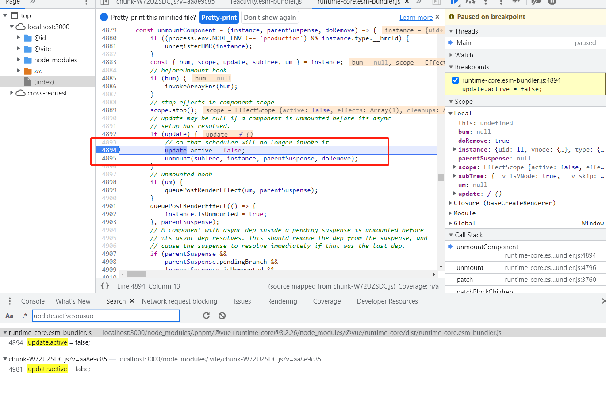
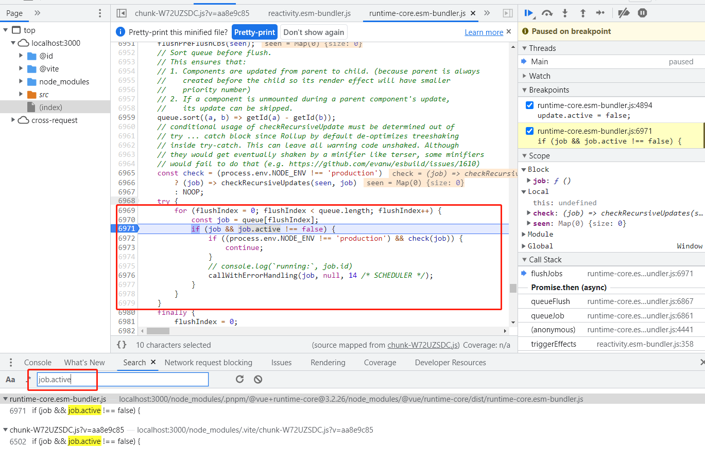

#Demo 3 —— 队列 Job 可能会失效

该 Demo 构造一下内容：
1. 父组件 update 函数和子组件 update 函数先后进入队列
2. 父组件更新时，子组件被卸载

## 建议的断点调试位置

### 组件 update 函数被设置为失效
全局搜索 `update.active`，如图：

### 队列不运行失效 Job
全局搜索 `job.active`，如图：

 
