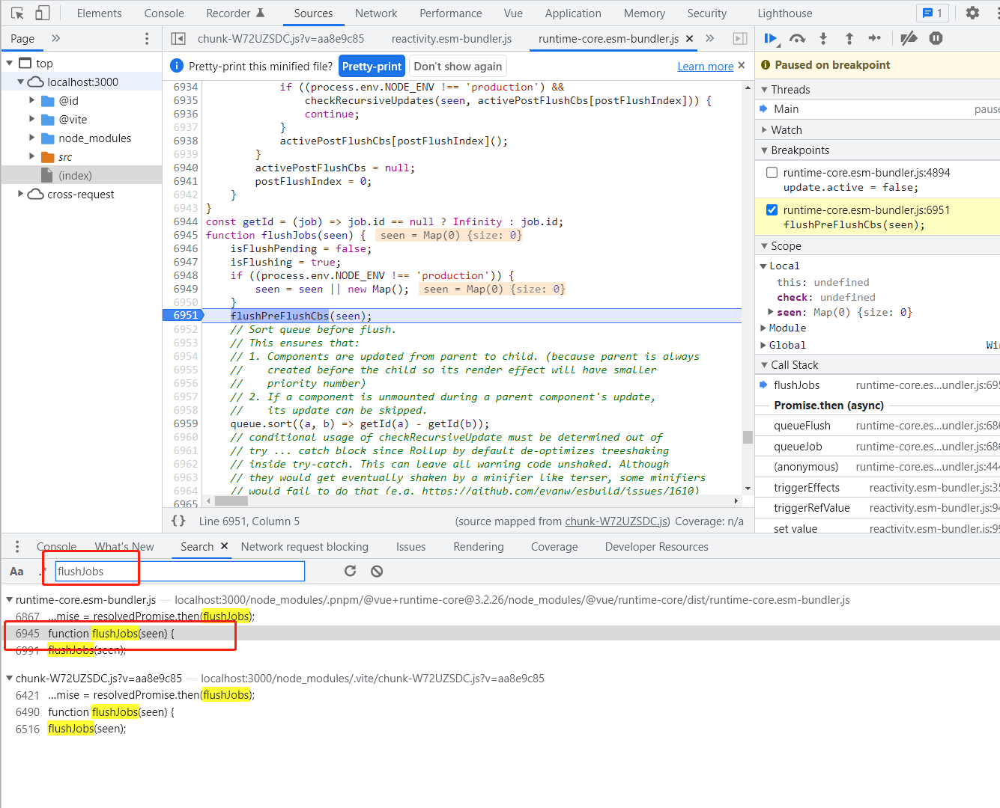

# Demo 5 —— 一个队列还不够

该 Demo 构造一下内容：
1. 在按钮回调中，对响应式进行 watchValue 加一和建议，最后的值不变
2. watch，watchValue

证明，watch 需要依赖组件的 watchValue 的最终结果，来判断是否要执行回调

## 建议的断点调试位置
> 在页面加载完，点击按钮前加断点。

全局搜索 `flushJobs`，找到函数的定义，如图：

在该位置，执行 Pre 队列
