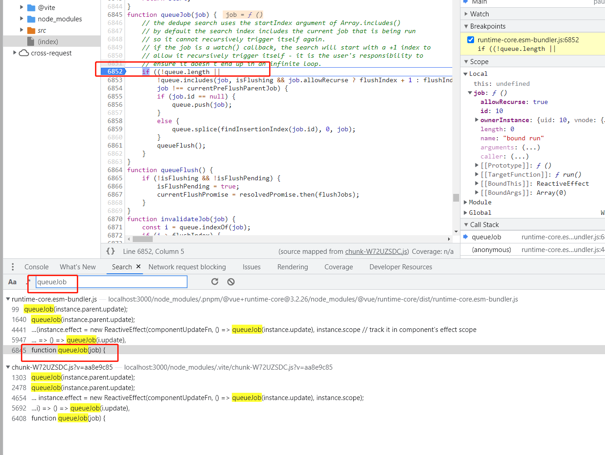

# demo 8 —— 递归 Job

该 Demo 构造以下内容：
1. 父组件 update 函数被加入队列
2. 父组件 update 过程中，会更新子组件属性
3. 子组件属性改变后，会触发 watch，emit 事件，导致父组件依赖的数据被改变
4. 父组件 update 函数再次被加入队列

## 建议的断点调试位置
> 在页面加载完，点击按钮前加断点。

全局搜索 `queueJob`，找到函数的定义，如图：

